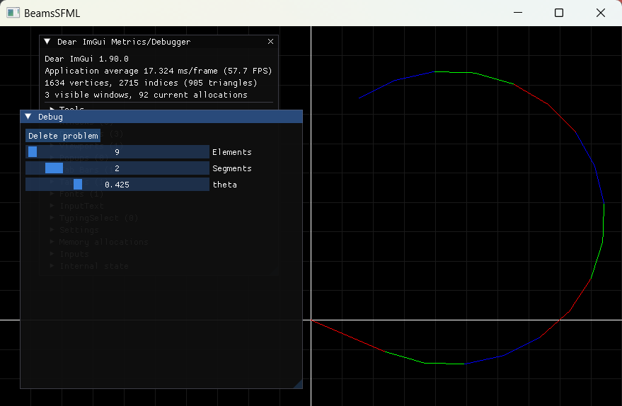

# Beams
This is a cross-platform software for studying and solving 
**2d beam deformation problems**,
written in `C++` & `GLSL`
and built via `CMake`.

### What & Why?
While studying geometric (2d or 3d) shapes, it is often handy to visualize them on a screen;
*and the higher resolution is, the better*.
This, however, adds a significant computational cost, which prevents users from testing new ideas 
*(e.g. changes in algorithms)* quickly.

In the past, I've [written a `Python` software](https://github.com/55AAh/helix-implementation) 
that provided an interactive interface using `Matplotlib`,
and the user had an option to switch off the rendering while the computation continues
(or even to run without GUI & rendering at all).
However, it proved to be clunky and hard to maintain.

That's why a new approach was chosen:
1. Use `C++` & low-level `OpenGL` to achieve bloat-free & fast operation; 
2. Design an architecture that splits Computing & Rendering into separate modules; 
3. Preferably, move Rendering to GPU;
4. Develop a simple Immediate mode GUI.

### How to use?
* Clone repository in `CLion`;
* Press `Run`;
* Enjoy!

### How does it work?
Is uses `SFML` as a cross-platform windowing backend, and `OpenGL 4.3` with `GLEW` to render beam configuration
using shaders.
`Dear ImGui` is used to make a GUI.
Project is built via `CMake`

The project is split into 2 separate CMake targets:
* `Solver` - Computing module (can be linked by an outside user and called to compute solutions):
  * `formulae.h` - a `GLSL`-compatible `C` header containing the implementation of the formulae in question.
It will be included directly in the shader code!
This is the best possible way to abide the DRY principle that I've managed to find;
  * `Solver.h` & `Solver.cpp` - a `C++` wrapper-interface that enables to perform computation on a whole beam
rather than on a single element. Also provides an implementation for the interactive solution algorithm.

* `ShaderBeams` - Visual module:
  * `shader_buffers.h` & `shader_buffers.cpp` - an interface that allows both modules to communicate
via `OpenGL` machinery;
  * `main.cpp` - windowing & GUI.

### Dependencies
The following libraries are used via `CMake`'s `FetchContent` & `target_link_libraries`:
* `SFML`
* `OpenGL 4.3`
* `GLEW`
* `Dear ImGui`
* `ImGui-SFML`
